# CondoMarket 🏢

<div align="center">

### *Donde Tu Edificio Se Convierte en Tu Mercado*

[](/)
[](/)
[](/)

</div>

---

## 🎯 ¿Qué es CondoMarket?

CondoMarket es una **plataforma de mercado hiperlocal** diseñada exclusivamente para edificios de apartamentos, condominios y comunidades residenciales. Piensa en ella como un mercado privado donde los vecinos pueden comprar, vender e intercambiar productos y servicios dentro de su edificio o complejo.

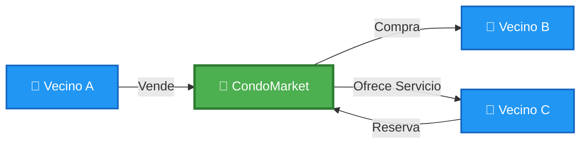

## 🔍 El Problema que Resolvemos

<table>
<tr>
<td width="50%" valign="top">

### ⚠️ Los Desafíos

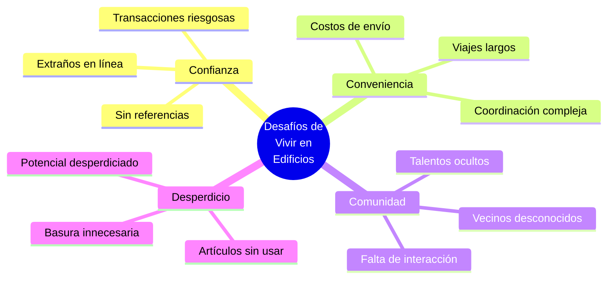

</td>
<td width="50%" valign="top">

### ✨ Nuestra Solución

**CondoMarket transforma estos desafíos en oportunidades:**

🔐 **Confianza Verificada**
- Todos son vecinos verificados
- Reputación transparente
- Responsabilidad natural

📍 **Ultra Conveniente**
- Todo en tu edificio
- Sin costos de envío
- Encuentros fáciles

🤝 **Construcción de Comunidad**
- Conoce a tus vecinos
- Descubre talentos locales
- Crea conexiones

♻️ **Sostenibilidad**
- Reutilización local
- Menos desperdicio
- Economía circular

</td>
</tr>
</table>

## 💡 Qué Puedes Hacer en CondoMarket

<div align="center">

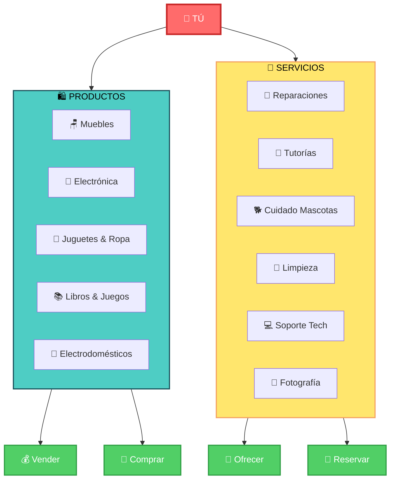

</div>

## 🚀 Cómo Funciona

<div align="center">

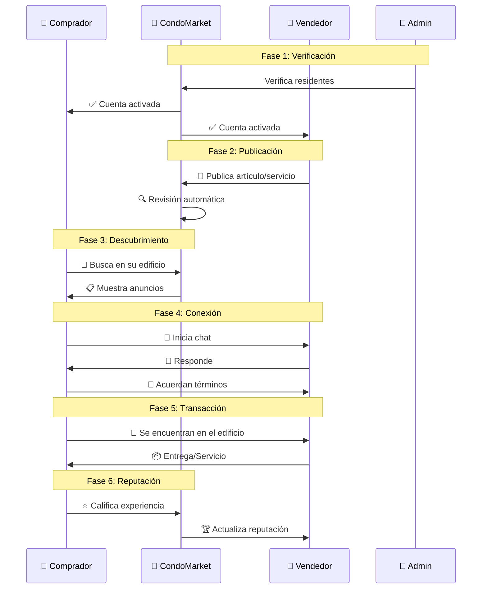

</div>

---

<table>
<tr>
<td width="33%" align="center">

### 🛒 Para Compradores

```
┌─────────────────┐
│  1. 🔎 Explora  │
│     Anuncios    │
└────────┬────────┘
         │
┌────────▼────────┐
│  2. 💬 Chatea   │
│  con Vendedores │
└────────┬────────┘
         │
┌────────▼────────┐
│  3. 🏢 Reúnete  │
│   en Edificio   │
└────────┬────────┘
         │
┌────────▼────────┐
│  4. ⭐ Califica │
│   Experiencia   │
└─────────────────┘
```

</td>
<td width="33%" align="center">

### 💼 Para Vendedores

```
┌─────────────────┐
│  1. 📝 Publica  │
│   Gratis/Premium│
└────────┬────────┘
         │
┌────────▼────────┐
│  2. 🔔 Recibe   │
│    Interesados  │
└────────┬────────┘
         │
┌────────▼────────┐
│  3. 📅 Coordina │
│   Entrega/Hora  │
└────────┬────────┘
         │
┌────────▼────────┐
│  4. 🏆 Construye│
│    Reputación   │
└─────────────────┘
```

</td>
<td width="33%" align="center">

### 🔑 Para Admins

```
┌─────────────────┐
│  1. ✅ Verifica │
│    Residentes   │
└────────┬────────┘
         │
┌────────▼────────┐
│  2. 🛡️ Modera  │
│     Anuncios    │
└────────┬────────┘
         │
┌────────▼────────┐
│  3. 📊 Monitorea│
│    Actividad    │
└────────┬────────┘
         │
┌────────▼────────┐
│  4. 🤝 Fomenta  │
│    Comunidad    │
└─────────────────┘
```

</td>
</tr>
</table>

## ✨ Características Principales

<div align="center">

```mermaid
graph TD
    CM[🏢 CondoMarket]
    
    CM --> F1[🔐 Comunidad<br/>Verificada]
    CM --> F2[💬 Chat<br/>Integrado]
    CM --> F3[📅 Programación<br/>de Servicios]
    CM --> F4[⭐ Sistema de<br/>Reputación]
    CM --> F5[🔔 Notificaciones<br/>Inteligentes]
    CM --> F6[💎 Características<br/>Premium]
    
    F1 --> F1A[✅ Verificación residencial]
    F1 --> F1B[🛡️ Ambiente seguro]
    
    F2 --> F2A[🔒 Privacidad protegida]
    F2 --> F2B[💬 Mensajería directa]
    
    F3 --> F3A[⏰ Recordatorios]
    F3 --> F3B[✅ Confirmaciones]
    
    F4 --> F4A[⭐ Calificaciones]
    F4 --> F4B[🏆 Mejor visibilidad]
    
    F5 --> F5A[🆕 Nuevos anuncios]
    F5 --> F5B[📨 Mensajes]
    F5 --> F5C[📦 Estado de pedidos]
    
    F6 --> F6A[📈 Más anuncios]
    F6 --> F6B[🎯 Prioridad en búsqueda]
    F6 --> F6C[📊 Analytics avanzados]
    F6 --> F6D[⭐ Anuncios destacados]
    
    style CM fill:#FF6B6B,stroke:#C92A2A,stroke-width:4px,color:#fff
    style F1 fill:#4ECDC4,stroke:#1A535C,stroke-width:2px
    style F2 fill:#4ECDC4,stroke:#1A535C,stroke-width:2px
    style F3 fill:#4ECDC4,stroke:#1A535C,stroke-width:2px
    style F4 fill:#4ECDC4,stroke:#1A535C,stroke-width:2px
    style F5 fill:#4ECDC4,stroke:#1A535C,stroke-width:2px
    style F6 fill:#FFE66D,stroke:#F4A261,stroke-width:2px
```

</div>

---

<table>
<tr>
<td width="50%">

### 🔐 Comunidad Verificada
> *Confianza desde el primer momento*

Cada usuario es verificado como residente de su edificio, creando un ambiente de confianza donde **sabes con quién estás tratando**.

**Beneficios:**
- ✅ Identidad verificada
- 🏢 Vinculado a tu edificio
- 🛡️ Mayor seguridad

</td>
<td width="50%">

### 💬 Chat Integrado
> *Comunicación segura y privada*

Envía mensajes directamente sin compartir información personal hasta que estés listo.

**Beneficios:**
- 🔒 Privacidad protegida
- 💬 Mensajería en tiempo real
- 📱 Notificaciones instantáneas

</td>
</tr>
<tr>
<td width="50%">

### 📅 Programación de Servicios
> *Organiza tu tiempo fácilmente*

Reserva servicios en horarios convenientes con recordatorios y confirmaciones automáticas.

**Beneficios:**
- ⏰ Recordatorios automáticos
- ✅ Confirmaciones instantáneas
- 📆 Gestión de agenda

</td>
<td width="50%">

### ⭐ Sistema de Reputación
> *Construye confianza con cada interacción*

Las calificaciones ayudan a identificar los mejores vendedores y servicios.

**Beneficios:**
- ⭐ Calificaciones transparentes
- 🏆 Mejor posicionamiento
- 💯 Historial verificable

</td>
</tr>
<tr>
<td width="50%">

### 🔔 Notificaciones Inteligentes
> *Nunca pierdas una oportunidad*

**Recibe notificaciones sobre:**
- 🆕 Nuevos anuncios relevantes
- 💬 Mensajes de interesados
- 📅 Confirmaciones de reserva
- 📦 Actualizaciones de estado

</td>
<td width="50%">

### 💎 Características Premium
> *Destaca y vende más*

**Los vendedores pueden actualizar para:**
- 📈 **Más Anuncios** activos
- 🎯 **Prioridad** en búsquedas
- 📊 **Analytics** detallados
- ⭐ **Destacados** visuales

</td>
</tr>
</table>

## 🎁 Los Beneficios

<div align="center">

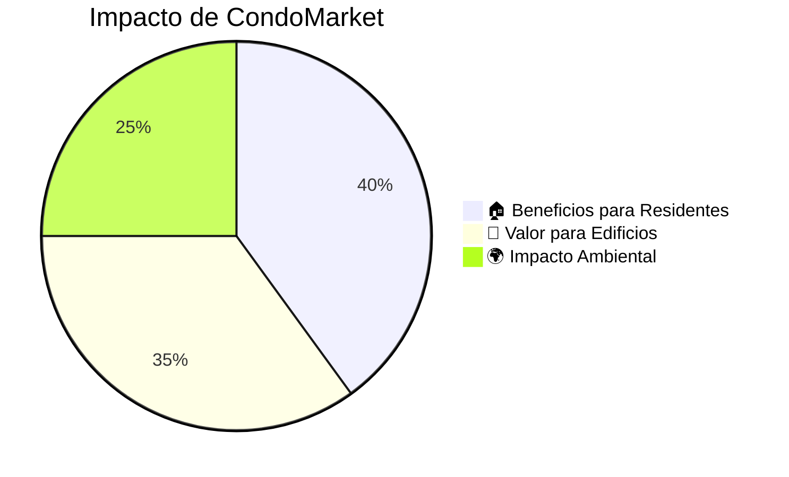

</div>

---

<table>
<tr>
<td width="33%" align="center" valign="top">

### 🏠 Para Residentes

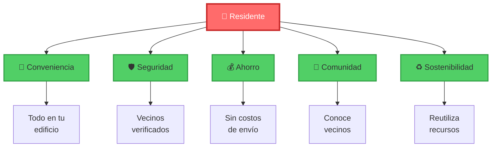

**Beneficios Clave:**
- ✅ Todo sucede dentro de tu edificio
- 🛡️ Trata con vecinos verificados
- 💰 Sin costos de envío, mejores precios
- 🤝 Conoce a tus vecinos
- ♻️ Reduce el desperdicio

</td>
<td width="33%" align="center" valign="top">

### 🏢 Para Edificios

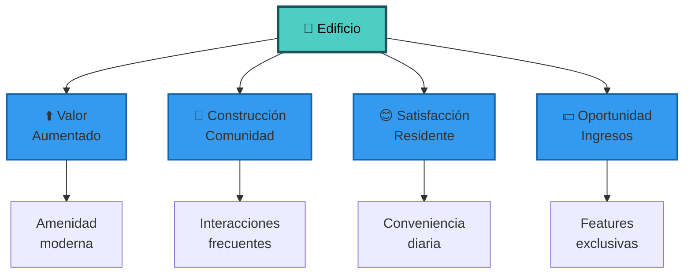

**Beneficios Clave:**
- 🏆 Amenidad moderna que atrae residentes
- 🤝 Fomenta interacciones entre vecinos
- ✨ Añade conveniencia a la vida diaria
- 💼 Oportunidades de ingresos adicionales

</td>
<td width="33%" align="center" valign="top">

### 🌍 Para el Medio Ambiente

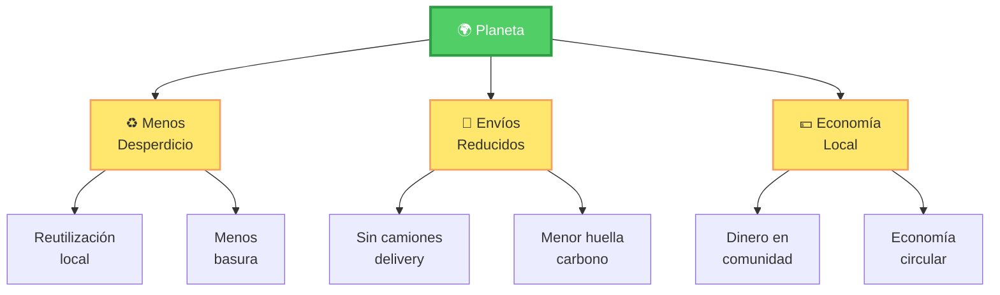

**Beneficios Clave:**
- ♻️ Artículos encuentran nuevos hogares
- 🚫 No se necesitan camiones de entrega
- 💚 Reduce la huella de carbono
- 🔄 Economía circular local

</td>
</tr>
</table>

## 📖 Casos de Uso Reales

<div align="center">

### 📅 Un Día Típico en CondoMarket

| ⏰ Hora | 📍 Actividad | 💡 Resultado |
|---------|-------------|--------------|
| **08:00** | 💼 Emma ofrece diseño de logos | Nuevo servicio disponible |
| **09:30** | 🔧 María recibe emergencia de plomería | Problema resuelto en 1 hora |
| **12:00** | 🪑 Sarah publica sus muebles | Mudanza facilitada |
| **13:30** | 📚 Club de lectura se descubre | Nueva comunidad formada |
| **16:00** | 👶 Familia Rodríguez dona ropa | Sostenibilidad en acción |
| **18:00** | ✅ Todas las transacciones completadas | Vecinos felices |

</div>

---

<table>
<tr>
<td width="50%" valign="top">

### 📦 Día de Mudanza Simplificado

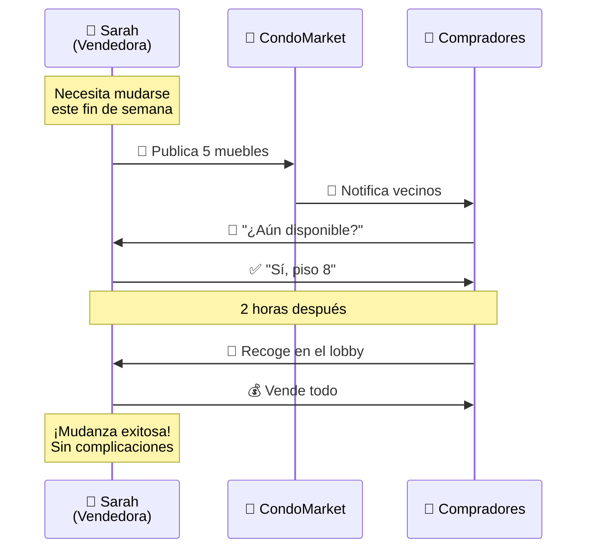

**Resultado:** ✨ Todo vendido en horas, sin estrés de coordinación

</td>
<td width="50%" valign="top">

### 🔧 Ayuda Rápida Cuando la Necesitas

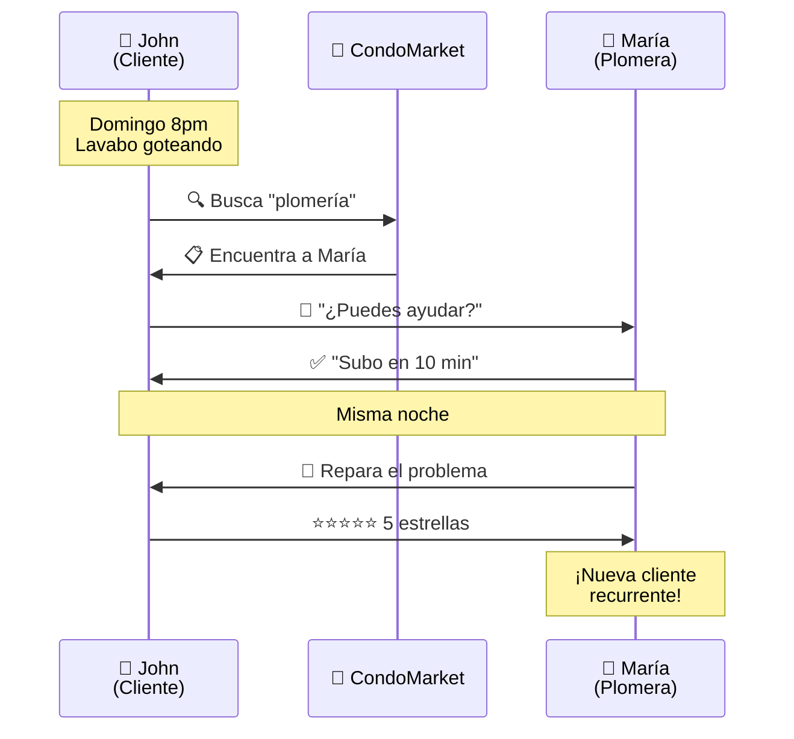

**Resultado:** 🚀 Problema resuelto en 1 hora, nueva relación de confianza

</td>
</tr>
<tr>
<td width="50%" valign="top">

### 📚 Construyendo Comunidad

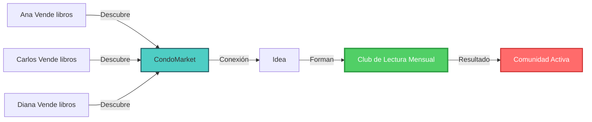

**👤 Ana, Carlos, Diana** → **📚 Descubren intereses comunes** → **📖 Club de Lectura** → **🤝 Comunidad Activa**

**Resultado:** 🌟 De extraños a amigos, comunidad más fuerte

</td>
<td width="50%" valign="top">

### 💼 Ingresos Adicionales

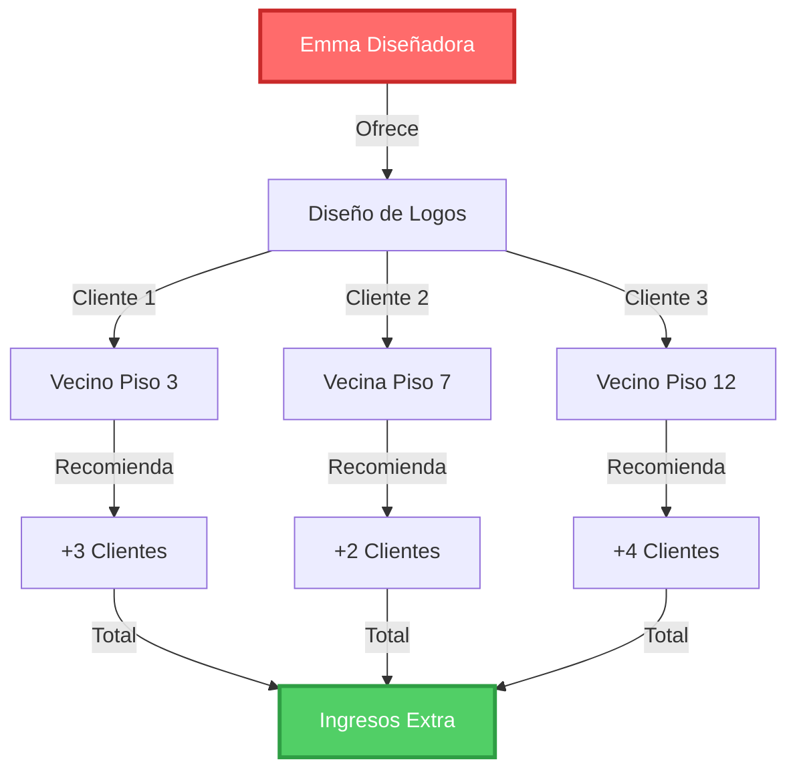

**👩‍💻 Emma** → **💼 Ofrece servicios** → **👥 3 clientes iniciales** → **📈 9 clientes por referidos** → **💰 Ingresos sin salir de casa**

**Resultado:** 💎 Base de clientes sólida, negocio local próspero

</td>
</tr>
<tr>
<td colspan="2" valign="top">

### ♻️ Vida Sostenible

<div align="center">

```mermaid
graph LR
    A[Familia Rodriguez] -->|Dona| B[CondoMarket]
    B -->|Recibe| C[Familia Garcia]
    C -->|Dona| D[CondoMarket]
    D -->|Recibe| E[Familia Lopez]
    E -->|Ciclo continua| F[Economia Circular]
    
    style A fill:#4ECDC4,stroke:#1A535C,stroke-width:2px
    style C fill:#4ECDC4,stroke:#1A535C,stroke-width:2px
    style E fill:#4ECDC4,stroke:#1A535C,stroke-width:2px
    style F fill:#51CF66,stroke:#2F9E44,stroke-width:3px,color:#fff
```

**👨‍👩‍👧‍👦 Familia Rodríguez** (Ropa 4-6) → **📦 CondoMarket** → **👨‍👩‍👶 Familia García** → **📦 CondoMarket** → **👨‍👩‍👧 Familia López** → **♻️ Economía Circular**

**Impacto Acumulado:**
- 🌍 **50+ artículos** reutilizados
- 💰 **$500+** ahorrados por familia
- ♻️ **30 kg** menos de basura al año
- 🤝 **3 familias** conectadas

</div>

</td>
</tr>
</table>

## 🎯 Por Qué Funciona CondoMarket

<div align="center">

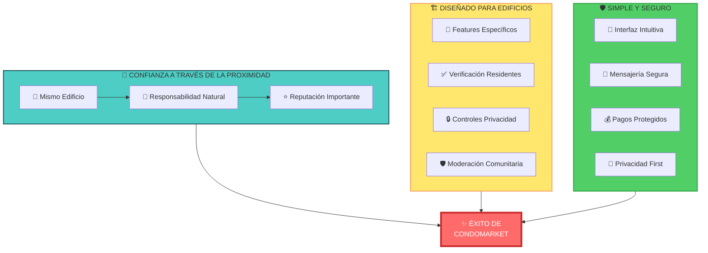

</div>

---

<table>
<tr>
<td width="33%" align="center">

### 🤝 Confianza por Proximidad

```
   🏢 Edificio
   ┌────────────┐
   │ Piso 12 👤 │ ← Conocidos
   │ Piso 11 👤 │ ← Vecinos
   │ Piso 10 👤 │ ← Tu piso
   │ Piso  9 👤 │ ← Vecinos
   │ Piso  8 👤 │ ← Conocidos
   └────────────┘
```

**Nadie quiere arruinar su reputación con vecinos que ve todos los días**

✅ Responsabilidad natural  
✅ Comunidad cerrada  
✅ Confianza verificable

</td>
<td width="33%" align="center">

### 🏗️ Diseñado para Edificios

```
     CondoMarket
          │
    ┌─────┴─────┐
    │           │
   🏢          🏢
Edificio A  Edificio B
    │           │
   👥          👥
 Vecinos     Vecinos
```

**Cada edificio es su propio marketplace privado**

🔧 Features personalizados  
✅ Verificación integrada  
🔒 Privacidad por diseño  
🛡️ Moderación local

</td>
<td width="33%" align="center">

### 🛡️ Simple y Seguro

```
       Usuario
          │
    ┌─────┼─────┐
    │     │     │
   📱   💬    💰
  Móvil Chat Pagos
    │     │     │
    └─────┼─────┘
          │
       🔐 Seguro
```

**Tecnología que protege, no complica**

📱 Apps intuitivas  
💬 Chat encriptado  
💰 Pagos opcionales  
🔐 Datos protegidos

</td>
</tr>
</table>

## 🚀 La Visión Futura

<div align="center">

### *Del Marketplace al Centro Digital de tu Comunidad*

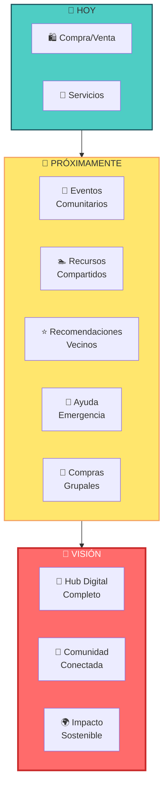

</div>

---

<table>
<tr>
<td width="50%" valign="top">

### 🎉 Eventos Comunitarios

**Calendario de Actividades:**

| 📅 Fecha | 🎯 Evento | 👥 Estado |
|----------|-----------|-----------|
| 05 Ene | 🧘 Yoga Matutino | ✅ Completado |
| 15 Ene | 🍖 BBQ Comunidad | ✅ Completado |
| 10 Feb | 🎬 Cine en Azotea | 🔴 En Progreso |
| 20 Feb | ♟️ Torneo de Ajedrez | 📅 Próximo |

**Organiza y asiste a actividades del edificio**
- 📅 Calendario compartido
- 🎫 RSVP integrado
- 📸 Galería de eventos
- 💬 Chat grupal

</td>
<td width="50%" valign="top">

### 🏊 Recursos Compartidos
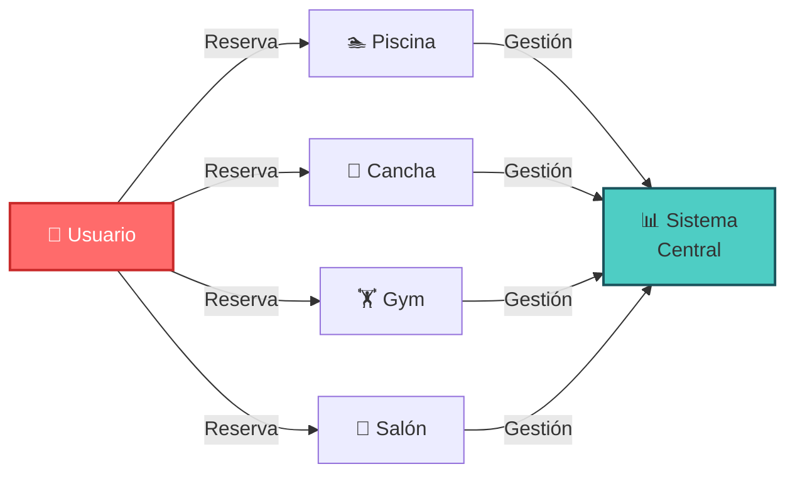

**Gestiona amenidades del edificio**
- 📅 Reservas en línea
- ⏰ Disponibilidad real
- 🔔 Recordatorios
- 💳 Pagos integrados

</td>
</tr>
<tr>
<td width="50%" valign="top">

### ⭐ Recomendaciones de Vecinos
```mermaid
graph TB
    P[📢 Pregunta:<br/>"¿Buen plomero?"]
    P --> R1[👤 María: "Plomería XYZ"]
    P --> R2[👤 Juan: "Plomería XYZ"]
    P --> R3[👤 Ana: "Plomería ABC"]
    
    R1 & R2 --> V[✅ 2 votos<br/>Plomería XYZ]
    R3 --> V2[1 voto<br/>Plomería ABC]
    
    V -->|Ganador| F[🏆 Recomendación<br/>Confiable]
    
    style P fill:#FFE66D,stroke:#F4A261,stroke-width:2px
    style F fill:#51CF66,stroke:#2F9E44,stroke-width:3px,color:#fff
```

**Encuentra servicios confiables**
- 🌟 Votación comunitaria
- 📝 Reviews detalladas
- 🔗 Directorio local
- 🤝 Confianza vecinal

</td>
<td width="50%" valign="top">

### 🚨 Ayuda de Emergencia
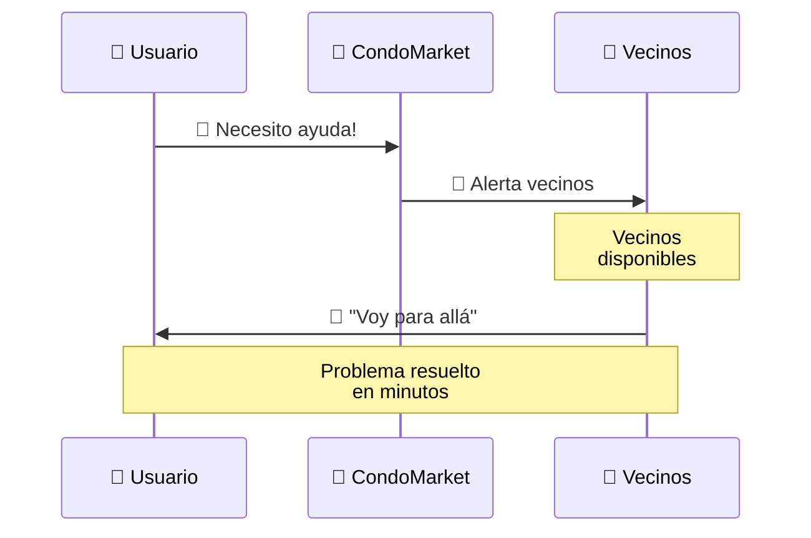

**Red de apoyo instantánea**
- 🚨 Alertas de emergencia
- 👥 Vecinos disponibles
- ⚡ Respuesta rápida
- 🤝 Comunidad solidaria

</td>
</tr>
<tr>
<td colspan="2" valign="top" align="center">

### 🛒 Compras Grupales

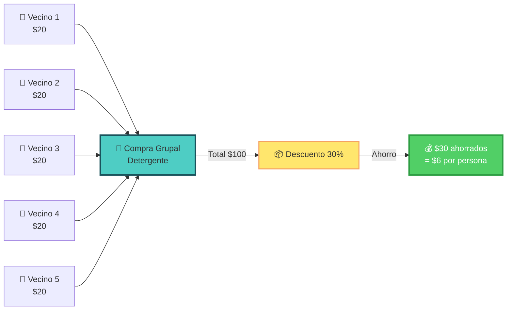

**Poder de compra colectivo**
- 💪 Compras al por mayor
- 💰 Mejores precios
- 📦 Entrega única
- ♻️ Menos empaques

</td>
</tr>
</table>

---

<div align="center">

### 🎯 El Objetivo Final

```mermaid
mindmap
  root((🏢 CondoMarket<br/>Hub Digital))
    Marketplace
      Productos
      Servicios
      Reputación
    Comunidad
      Eventos
      Chat grupal
      Conexiones
    Gestión
      Reservas
      Pagos
      Reportes
    Servicios
      Emergencias
      Recomendaciones
      Compras grupales
    Sostenibilidad
      Reutilización
      Economía local
      Menos desperdicio
```

</div>

## 🎬 Comenzando

<table>
<tr>
<td width="50%" align="center">

### 👤 Para Residentes

```mermaid
graph TD
    Start([🚀 Comenzar]) --> S1[1️⃣ Obtén código<br/>del edificio]
    S1 --> S2[2️⃣ Regístrate en<br/>CondoMarket]
    S2 --> S3[3️⃣ Verifica<br/>tu unidad]
    S3 --> S4[4️⃣ ¡Explora y<br/>publica!]
    S4 --> End([✨ Listo])
    
    style Start fill:#FF6B6B,stroke:#C92A2A,stroke-width:3px,color:#fff
    style End fill:#51CF66,stroke:#2F9E44,stroke-width:3px,color:#fff
    style S1 fill:#4ECDC4,stroke:#1A535C,stroke-width:2px
    style S2 fill:#4ECDC4,stroke:#1A535C,stroke-width:2px
    style S3 fill:#4ECDC4,stroke:#1A535C,stroke-width:2px
    style S4 fill:#4ECDC4,stroke:#1A535C,stroke-width:2px
```

**Es súper simple:**
1. 🔑 Obtén código de administración
2. 📱 Descarga la app o ve al web
3. ✅ Verifica tu unidad
4. 🎉 ¡Empieza a usar CondoMarket!

</td>
<td width="50%" align="center">

### 🏢 Para Administradores

```mermaid
graph TD
    Start([🏢 Iniciar]) --> A1[1️⃣ Registra<br/>tu edificio]
    A1 --> A2[2️⃣ Invita<br/>residentes]
    A2 --> A3[3️⃣ Configura<br/>preferencias]
    A3 --> A4[4️⃣ Monitorea<br/>actividad]
    A4 --> End([🌟 Comunidad<br/>próspera])
    
    style Start fill:#FF6B6B,stroke:#C92A2A,stroke-width:3px,color:#fff
    style End fill:#51CF66,stroke:#2F9E44,stroke-width:3px,color:#fff
    style A1 fill:#FFE66D,stroke:#F4A261,stroke-width:2px
    style A2 fill:#FFE66D,stroke:#F4A261,stroke-width:2px
    style A3 fill:#FFE66D,stroke:#F4A261,stroke-width:2px
    style A4 fill:#FFE66D,stroke:#F4A261,stroke-width:2px
```

**Panel de control completo:**
1. 🏗️ Registra tu edificio
2. 📧 Invita a residentes
3. ⚙️ Personaliza configuración
4. 📊 Ve el crecimiento

</td>
</tr>
</table>

---

<div align="center">

## 🌟 Únete a la Comunidad CondoMarket

### *Transforma tu edificio de un lugar donde la gente simplemente vive...*
### *...a una comunidad próspera donde los vecinos se ayudan entre sí*

```mermaid
graph LR
    A[🏢 Edificio<br/>Tradicional] -->|CondoMarket| B[🤝 Comunidad<br/>Conectada]
    
    A1[😐 Vecinos desconocidos] -.-> A
    A2[🚪 Puertas cerradas] -.-> A
    A3[🔇 Silencio] -.-> A
    
    B -.-> B1[😊 Vecinos amigos]
    B -.-> B2[🤝 Ayuda mutua]
    B -.-> B3[🎉 Comunidad activa]
    
    style A fill:#E9ECEF,stroke:#ADB5BD,stroke-width:2px
    style B fill:#51CF66,stroke:#2F9E44,stroke-width:4px,color:#fff
    style A1 fill:#FFE5E5,stroke:#FF6B6B,stroke-width:1px
    style A2 fill:#FFE5E5,stroke:#FF6B6B,stroke-width:1px
    style A3 fill:#FFE5E5,stroke:#FF6B6B,stroke-width:1px
    style B1 fill:#E7F5FF,stroke:#339AF0,stroke-width:1px
    style B2 fill:#E7F5FF,stroke:#339AF0,stroke-width:1px
    style B3 fill:#E7F5FF,stroke:#339AF0,stroke-width:1px
```

---

<br/>

### 📊 Impacto Real

<table>
<tr>
<td width="25%" align="center">

**👥 Usuarios Activos**
```
████████ 85%
```
De residentes participan activamente

</td>
<td width="25%" align="center">

**💰 Transacciones**
```
████████ $50k+
```
Generadas en comunidades

</td>
<td width="25%" align="center">

**⭐ Satisfacción**
```
█████████ 4.8/5
```
Calificación promedio

</td>
<td width="25%" align="center">

**♻️ Sostenibilidad**
```
████████ 2 tons
```
Menos desperdicio al año

</td>
</tr>
</table>

---

<br/>

## 🚀 ¿Listo para Empezar?

<table>
<tr>
<td width="33%" align="center">

### 📱 Residentes
**[Descarga la App](#)**


</td>
<td width="33%" align="center">

### 🏢 Administradores
**[Registra tu Edificio](#)**

Comienza gratis hoy mismo y ve cómo crece tu comunidad

</td>
<td width="33%" align="center">

### 💼 Contacto
**[Háblanos](#)**

¿Preguntas? Nuestro equipo está aquí para ayudarte

</td>
</tr>
</table>

<br/>

---

<br/>

<div align="center">

# CondoMarket 🏢

### *Donde Tu Edificio Se Convierte en Tu Mercado*

[](/)
[](mailto:hola@condomarket.com)
[](/)

<br/>

**Construyendo comunidades, una transacción a la vez** ✨

<br/>

```mermaid
graph LR
    A[🏢] --> B[🤝]
    B --> C[💚]
    
    style A fill:#4ECDC4,stroke:#1A535C,stroke-width:2px
    style B fill:#FF6B6B,stroke:#C92A2A,stroke-width:2px,color:#fff
    style C fill:#51CF66,stroke:#2F9E44,stroke-width:2px,color:#fff
```

**Tu Edificio** → **Tu Comunidad** → **Tu Mercado**

</div>
